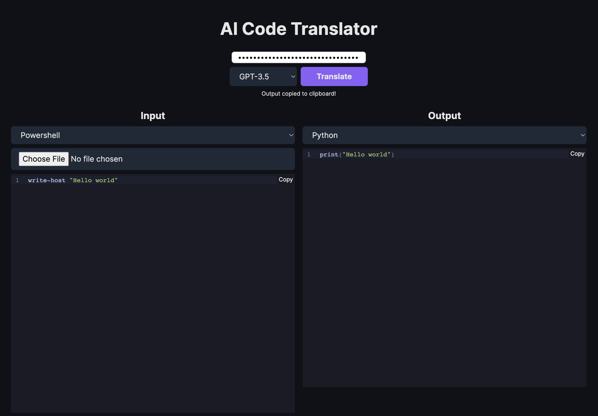

# AI Code Translator

Use AI to translate code from one language to another.



## Running Locally

**1. Clone Repo**

```bash
git clone https://github.com/sappkevin/ai-code-translator.git
```

**2. Install Dependencies**

```bash
npm i
```

**3. Run App**

```bash
npm run dev
```

## Troubleshooting Steps:

HTTP Response -> Error 500 

Log Message : You exceeded your current quota, please check your plan and billing details. 

Solution: Add a payment method to your https://openai.com account. Then regenerate a new API key from https://platform.openai.com/account/api-keys

## Credits

If you have any questions, feel free to reach out to the original author [Twitter](https://twitter.com/mckaywrigley).

Source Repo:
https://github.com/mckaywrigley/ai-code-translator
